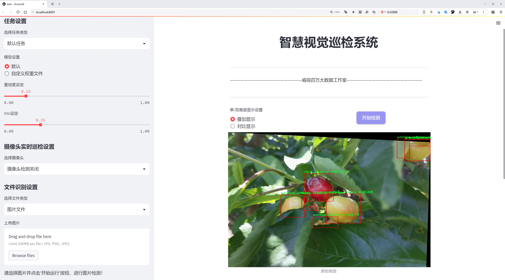
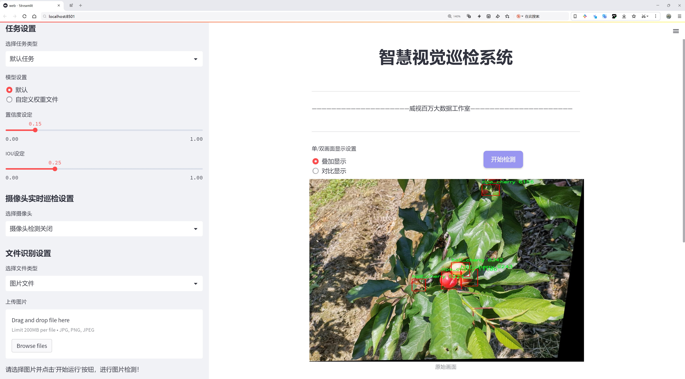
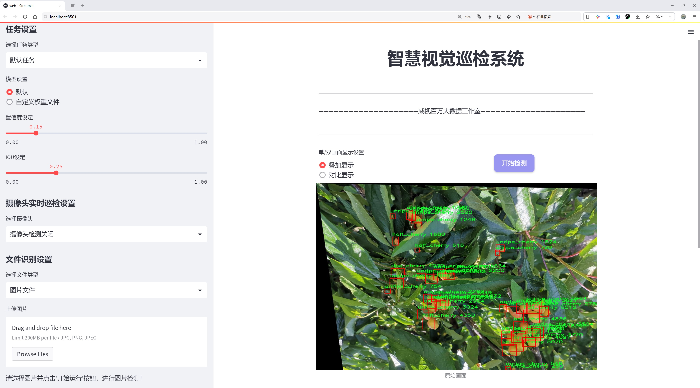
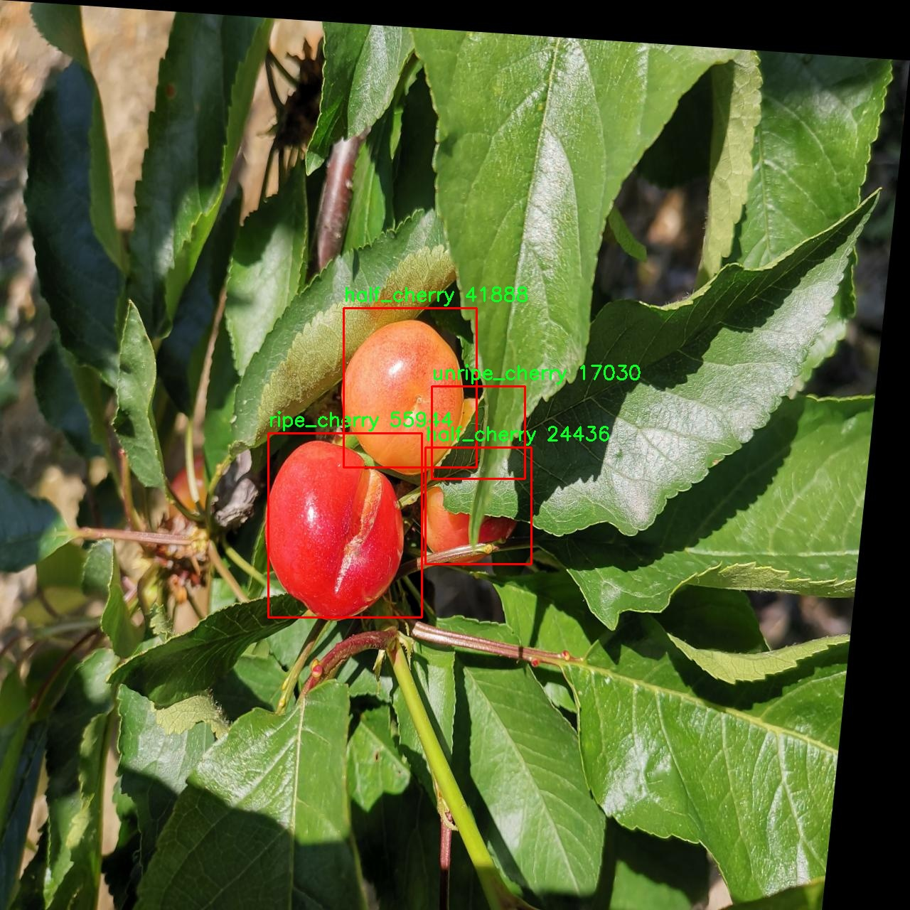
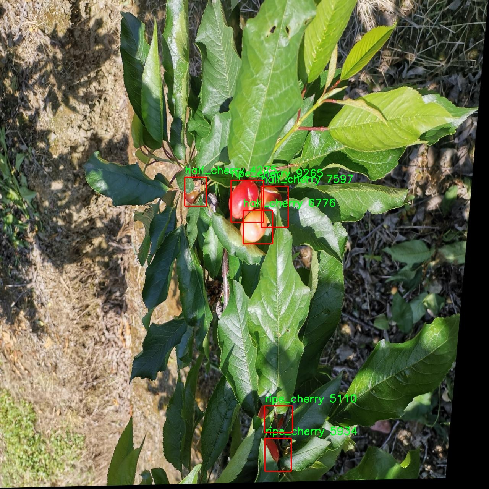
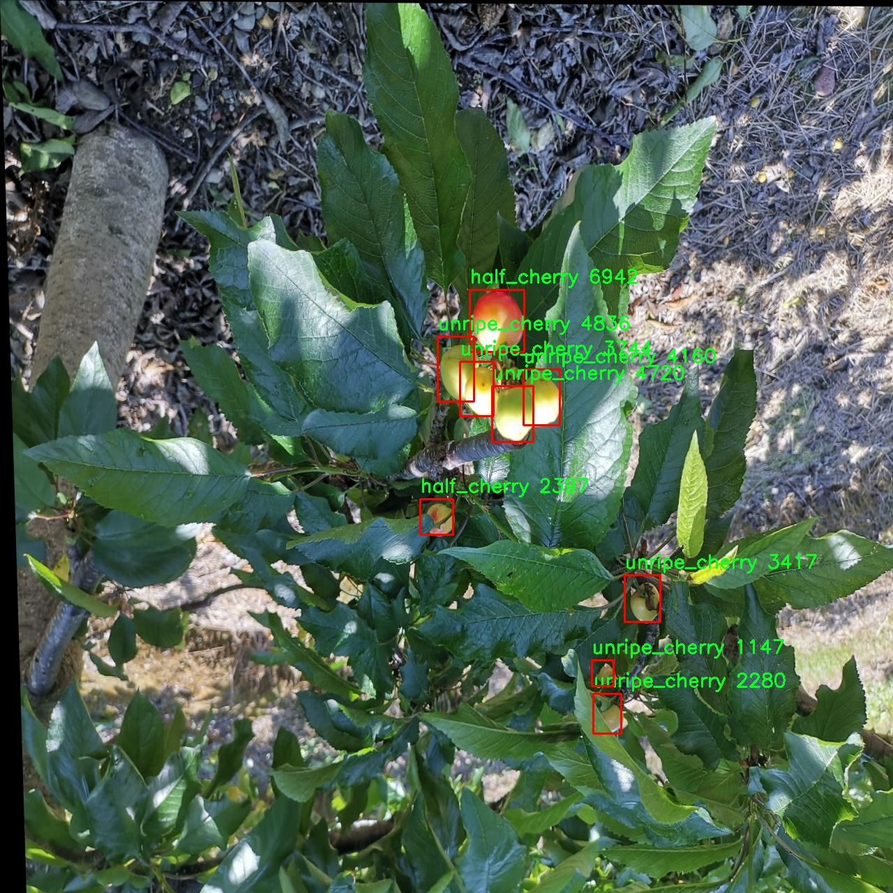
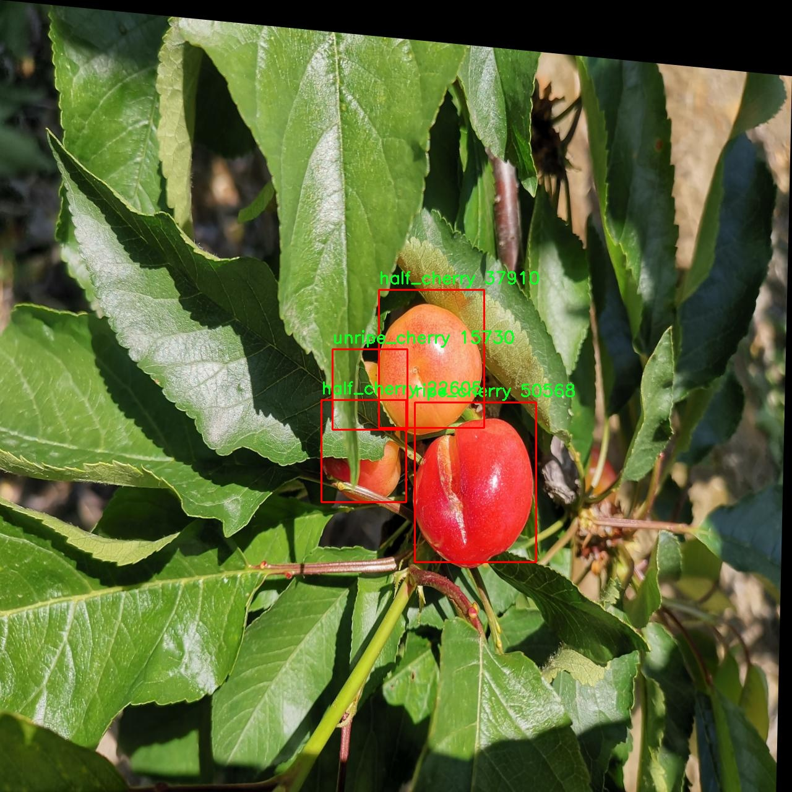
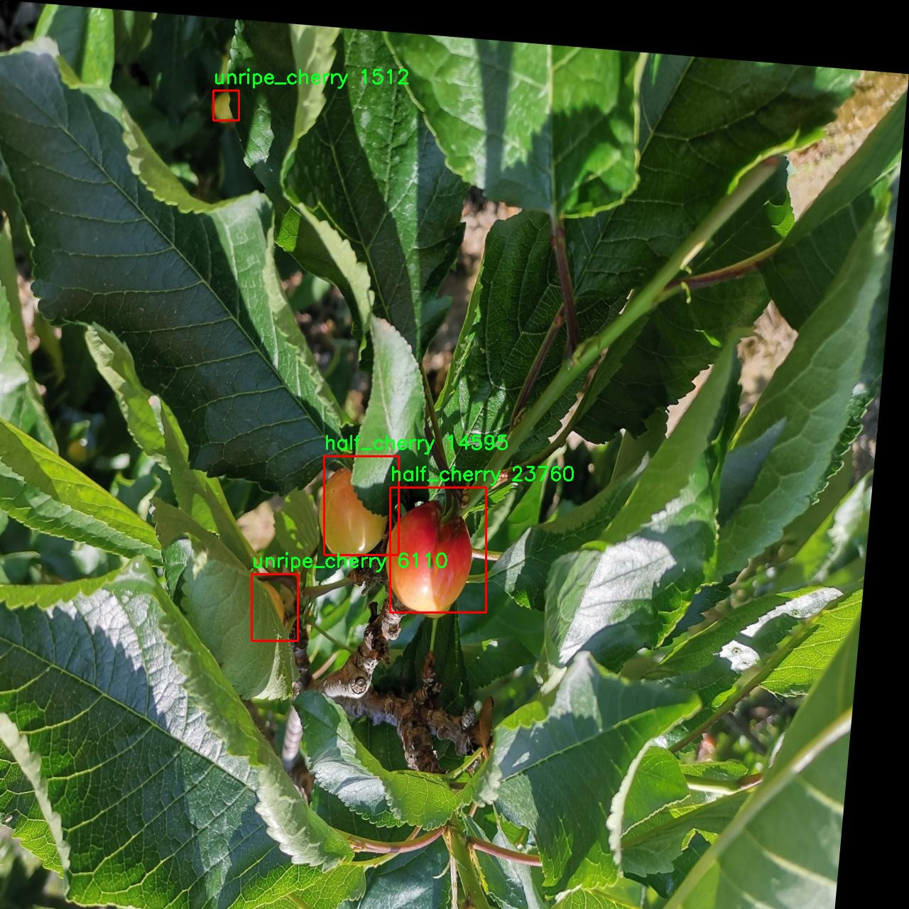

# 樱桃成熟度检测检测系统源码分享
 # [一条龙教学YOLOV8标注好的数据集一键训练_70+全套改进创新点发刊_Web前端展示]

### 1.研究背景与意义

项目参考[AAAI Association for the Advancement of Artificial Intelligence](https://gitee.com/qunshansj/projects)

项目来源[AACV Association for the Advancement of Computer Vision](https://gitee.com/qunmasj/projects)

研究背景与意义

随着全球人口的增长和人们生活水平的提高，水果消费量逐年上升，樱桃作为一种营养丰富且口感独特的水果，受到越来越多消费者的青睐。然而，樱桃的成熟度直接影响其市场价值和消费者的购买决策，因此，如何准确、快速地检测樱桃的成熟度成为了农业生产和市场销售中的一个重要课题。传统的樱桃成熟度检测方法多依赖于人工观察，不仅耗时耗力，而且受主观因素影响较大，容易导致检测结果的不一致性和不准确性。因此，开发一种高效、准确的樱桃成熟度检测系统具有重要的实际意义。

近年来，计算机视觉和深度学习技术的快速发展为农业领域的智能化提供了新的解决方案。YOLO（You Only Look Once）系列目标检测算法因其高效性和实时性，在物体检测任务中表现出色。YOLOv8作为该系列的最新版本，进一步提升了检测精度和速度，成为了进行水果成熟度检测的理想选择。然而，针对樱桃成熟度检测的特定需求，YOLOv8仍需进行一定的改进，以适应不同成熟度樱桃的特征识别。

本研究基于改进YOLOv8算法，构建了一套樱桃成熟度检测系统。该系统利用了一个包含2600张图像的数据集，数据集中涵盖了三种成熟度类别：半成熟樱桃、成熟樱桃和未成熟樱桃。这一数据集的构建为模型的训练和测试提供了丰富的样本，确保了模型在不同成熟度樱桃识别上的准确性和鲁棒性。通过对数据集的深入分析，我们可以提取出樱桃在不同成熟度阶段的视觉特征，进而为模型的改进提供理论依据。

此外，樱桃成熟度检测系统的研究不仅能够提高樱桃的市场竞争力，还能为果农提供科学的采摘建议，减少资源浪费，提升生产效率。通过自动化的成熟度检测，果农可以在最佳采摘时机进行采摘，从而确保樱桃的品质和口感，满足消费者的需求。同时，该系统的应用也将推动农业智能化的发展，促进农业与信息技术的深度融合，为实现可持续农业提供有力支持。

综上所述，基于改进YOLOv8的樱桃成熟度检测系统的研究，不仅具有重要的理论价值，还具备广泛的应用前景。通过提升樱桃成熟度检测的准确性和效率，能够有效推动樱桃产业的发展，促进农业现代化进程，最终实现经济效益与社会效益的双赢。

### 2.图片演示







##### 注意：由于此博客编辑较早，上面“2.图片演示”和“3.视频演示”展示的系统图片或者视频可能为老版本，新版本在老版本的基础上升级如下：（实际效果以升级的新版本为准）

  （1）适配了YOLOV8的“目标检测”模型和“实例分割”模型，通过加载相应的权重（.pt）文件即可自适应加载模型。

  （2）支持“图片识别”、“视频识别”、“摄像头实时识别”三种识别模式。

  （3）支持“图片识别”、“视频识别”、“摄像头实时识别”三种识别结果保存导出，解决手动导出（容易卡顿出现爆内存）存在的问题，识别完自动保存结果并导出到tempDir中。

  （4）支持Web前端系统中的标题、背景图等自定义修改，后面提供修改教程。

  另外本项目提供训练的数据集和训练教程,暂不提供权重文件（best.pt）,需要您按照教程进行训练后实现图片演示和Web前端界面演示的效果。

### 3.视频演示

[3.1 视频演示](https://www.bilibili.com/video/BV1bh44eDEth/)

### 4.数据集信息展示

##### 4.1 本项目数据集详细数据（类别数＆类别名）

nc: 3
names: ['half_cherry', 'ripe_cherry', 'unripe_cherry']


##### 4.2 本项目数据集信息介绍

数据集信息展示

在现代农业技术的快速发展中，计算机视觉技术的应用为农作物的管理和监测提供了新的解决方案。本研究所采用的数据集名为“Cerejas”，旨在为改进YOLOv8的樱桃成熟度检测系统提供高质量的训练数据。该数据集专注于樱桃的成熟度分类，包含三种不同的类别，分别是“半成熟樱桃”、“成熟樱桃”和“未成熟樱桃”。这些类别的划分不仅有助于精确识别樱桃的生长状态，还能为农民提供科学的采摘建议，从而提高樱桃的采摘效率和质量。

“Cerejas”数据集的构建经过精心设计，确保涵盖了樱桃在不同生长阶段的多样性。每个类别都包含了大量的图像样本，这些样本在不同的光照条件、背景环境和拍摄角度下进行采集，以增强模型的鲁棒性和泛化能力。通过这种方式，数据集能够有效地模拟实际农业环境中的各种复杂情况，使得训练出的模型在真实应用中表现更加优异。

在数据集的标注过程中，采用了专业的标注工具，确保每一张图像都经过准确的标注。标注人员根据樱桃的外观特征，结合农业专家的意见，对每一张图像进行分类。这种严谨的标注流程为后续的模型训练提供了坚实的基础，确保了数据集的高质量和高可靠性。

为了进一步提升模型的性能，数据集还包含了一些数据增强技术的应用，例如随机裁剪、旋转、颜色变换等。这些技术的引入不仅增加了数据集的多样性，还能有效减少模型的过拟合现象，使得模型在面对未见样本时依然能够保持良好的识别能力。此外，数据集的设计也考虑到了实际应用中的实时性需求，通过优化图像的分辨率和处理速度，确保模型能够在现场环境中快速响应。

在训练过程中，采用YOLOv8这一先进的目标检测算法，结合“Cerejas”数据集的特性，能够实现对樱桃成熟度的高效检测。YOLOv8以其优越的检测速度和准确性，成为了本研究的理想选择。通过对数据集的不断迭代和优化，研究团队希望能够在樱桃成熟度检测领域取得突破性进展，为农业生产提供更加智能化的解决方案。

总之，“Cerejas”数据集不仅是本研究的核心组成部分，更是推动樱桃成熟度检测技术发展的重要基石。通过对该数据集的深入分析和应用，研究团队期望能够为樱桃种植者提供科学、有效的管理工具，助力现代农业的可持续发展。随着技术的不断进步和数据集的持续更新，樱桃成熟度检测系统的应用前景将更加广阔，最终实现提高农业生产效率和农产品质量的目标。











### 5.全套项目环境部署视频教程（零基础手把手教学）

[5.1 环境部署教程链接（零基础手把手教学）](https://www.ixigua.com/7404473917358506534?logTag=c807d0cbc21c0ef59de5)


[5.2 安装Python虚拟环境创建和依赖库安装视频教程链接（零基础手把手教学）](https://www.ixigua.com/7404474678003106304?logTag=1f1041108cd1f708b01a)

### 6.手把手YOLOV8训练视频教程（零基础小白有手就能学会）

[6.1 手把手YOLOV8训练视频教程（零基础小白有手就能学会）](https://www.ixigua.com/7404477157818401292?logTag=d31a2dfd1983c9668658)

### 7.70+种全套YOLOV8创新点代码加载调参视频教程（一键加载写好的改进模型的配置文件）

[7.1 70+种全套YOLOV8创新点代码加载调参视频教程（一键加载写好的改进模型的配置文件）](https://www.ixigua.com/7404478314661806627?logTag=29066f8288e3f4eea3a4)

### 8.70+种全套YOLOV8创新点原理讲解（非科班也可以轻松写刊发刊，V10版本正在科研待更新）

由于篇幅限制，每个创新点的具体原理讲解就不一一展开，具体见下列网址中的创新点对应子项目的技术原理博客网址【Blog】：


[8.1 70+种全套YOLOV8创新点原理讲解链接](https://gitee.com/qunmasj/good)

### 9.系统功能展示（检测对象为举例，实际内容以本项目数据集为准）

图9.1.系统支持检测结果表格显示

  图9.2.系统支持置信度和IOU阈值手动调节

  图9.3.系统支持自定义加载权重文件best.pt(需要你通过步骤5中训练获得)

  图9.4.系统支持摄像头实时识别

  图9.5.系统支持图片识别

  图9.6.系统支持视频识别

  图9.7.系统支持识别结果文件自动保存

  图9.8.系统支持Excel导出检测结果数据


### 10.原始YOLOV8算法原理

原始YOLOv8算法原理

YOLOv8作为YOLO系列的最新版本，代表了目标检测领域的一次重要进步。其设计理念不仅继承了前几代模型的优点，还通过引入新技术和优化策略，进一步提升了模型的性能和灵活性。YOLOv8的架构主要由输入层、主干网络、颈部网络和头部网络组成，形成了一个高效的目标检测系统。

在输入层，YOLOv8首先对输入图像进行缩放，以满足模型对图像尺寸的要求。这一过程确保了模型能够处理不同尺寸的图像，从而增强了其适用性。接下来，主干网络通过一系列卷积操作对图像进行下采样，提取出丰富的特征信息。YOLOv8采用了CSPDarknet作为主干网络，这一结构通过将网络分为两个部分，每个部分包含多个残差块，显著提高了特征提取的效率和准确性。与前代模型YOLOv5相比，YOLOv8引入了C2f模块替代了C3模块。C2f模块的设计使得输入特征图被分为两个分支，经过各自的卷积层进行降维处理，最终通过一个卷积层进行特征融合。这种分支结构不仅增加了特征图的维度，还通过增强的梯度流信息提升了模型的学习能力。

YOLOv8在特征提取过程中还引入了快速空间金字塔池化（SPPF）结构。这一创新使得模型能够有效提取不同尺度的特征，同时显著减少了参数量和计算量。SPPF通过三个最大池化层的组合，增强了网络对多尺度特征的抽象能力，确保了模型在面对复杂场景时的鲁棒性。

在颈部网络部分，YOLOv8采用了特征金字塔网络（FPN）和路径聚合网络（PAN）的结合结构。这一设计通过多个卷积层和池化层的组合，进一步处理和压缩特征图。FPN结构的引入使得模型能够有效融合来自不同尺度的特征信息，而PAN则通过路径聚合的方式增强了特征的传递效率。这种多层次的特征融合策略，使得YOLOv8在目标检测时能够充分利用不同层次的特征，从而提高了检测的准确性。

在目标检测的实现上，YOLOv8采用了一种基于无锚框（Anchor-Free）的检测方式。这一创新使得模型能够直接预测目标的中心点及其宽高比例，避免了传统Anchor框方法所带来的复杂性和局限性。通过这种方式，YOLOv8不仅减少了Anchor框的数量，还提高了检测速度和准确度。这种直接预测的方式使得模型在处理复杂场景时，能够更快速地做出反应，从而满足实时检测的需求。

YOLOv8的头部网络采用了解耦的检测头，通过两个并行的卷积分支分别计算回归和类别的损失。这一设计使得模型在进行目标检测时，能够更加清晰地分离目标的定位和分类任务，从而提高了整体的检测性能。通过这样的结构，YOLOv8能够在保证高精度的同时，保持较快的检测速度，为实际应用提供了强有力的支持。

综上所述，YOLOv8的原始算法原理通过高效的特征提取、灵活的特征融合和创新的目标检测策略，构建了一个在准确性和速度上都表现优异的目标检测模型。其设计不仅吸收了前代模型的精华，还通过引入新的技术和方法，推动了目标检测领域的发展。随着YOLOv8的发布，目标检测的应用场景将更加广泛，尤其是在需要实时响应的任务中，如自动驾驶、安防监控和工业自动化等领域，YOLOv8无疑将发挥重要作用。


### 11.项目核心源码讲解（再也不用担心看不懂代码逻辑）

#### 11.1 70+种YOLOv8算法改进源码大全和调试加载训练教程（非必要）\ultralytics\utils\callbacks\tensorboard.py

以下是经过精简和注释的核心代码部分，主要功能是使用 TensorBoard 记录训练过程中的标量和模型图。

```python
# 导入必要的库
from ultralytics.utils import LOGGER, SETTINGS, TESTS_RUNNING, colorstr

try:
    # 尝试导入 TensorBoard 的 SummaryWriter
    from torch.utils.tensorboard import SummaryWriter

    # 确保当前不是测试运行
    assert not TESTS_RUNNING  
    # 确保 TensorBoard 集成已启用
    assert SETTINGS['tensorboard'] is True  
    WRITER = None  # 初始化 TensorBoard SummaryWriter 实例

except (ImportError, AssertionError, TypeError):
    # 处理导入错误或断言错误
    SummaryWriter = None  # 如果导入失败，SummaryWriter 设置为 None


def _log_scalars(scalars, step=0):
    """将标量值记录到 TensorBoard。"""
    if WRITER:  # 如果 WRITER 存在
        for k, v in scalars.items():  # 遍历标量字典
            WRITER.add_scalar(k, v, step)  # 记录标量


def _log_tensorboard_graph(trainer):
    """将模型图记录到 TensorBoard。"""
    try:
        import warnings
        from ultralytics.utils.torch_utils import de_parallel, torch

        imgsz = trainer.args.imgsz  # 获取输入图像大小
        imgsz = (imgsz, imgsz) if isinstance(imgsz, int) else imgsz  # 确保为元组格式
        p = next(trainer.model.parameters())  # 获取模型参数以确定设备和类型
        im = torch.zeros((1, 3, *imgsz), device=p.device, dtype=p.dtype)  # 创建输入图像（必须为零）

        with warnings.catch_warnings():
            warnings.simplefilter('ignore', category=UserWarning)  # 忽略 JIT 跟踪警告
            WRITER.add_graph(torch.jit.trace(de_parallel(trainer.model), im, strict=False), [])  # 记录模型图
    except Exception as e:
        LOGGER.warning(f'WARNING ⚠️ TensorBoard graph visualization failure {e}')  # 记录警告


def on_pretrain_routine_start(trainer):
    """初始化 TensorBoard 记录。"""
    if SummaryWriter:  # 如果 SummaryWriter 存在
        try:
            global WRITER
            WRITER = SummaryWriter(str(trainer.save_dir))  # 创建 SummaryWriter 实例
            prefix = colorstr('TensorBoard: ')
            LOGGER.info(f"{prefix}Start with 'tensorboard --logdir {trainer.save_dir}', view at http://localhost:6006/")  # 提示用户启动 TensorBoard
        except Exception as e:
            LOGGER.warning(f'WARNING ⚠️ TensorBoard not initialized correctly, not logging this run. {e}')  # 记录初始化错误


def on_train_start(trainer):
    """记录 TensorBoard 图。"""
    if WRITER:  # 如果 WRITER 存在
        _log_tensorboard_graph(trainer)  # 记录模型图


def on_batch_end(trainer):
    """在训练批次结束时记录标量统计信息。"""
    _log_scalars(trainer.label_loss_items(trainer.tloss, prefix='train'), trainer.epoch + 1)  # 记录训练损失


def on_fit_epoch_end(trainer):
    """在训练周期结束时记录周期指标。"""
    _log_scalars(trainer.metrics, trainer.epoch + 1)  # 记录训练指标


# 定义回调函数字典，只有在 SummaryWriter 存在时才会被填充
callbacks = {
    'on_pretrain_routine_start': on_pretrain_routine_start,
    'on_train_start': on_train_start,
    'on_fit_epoch_end': on_fit_epoch_end,
    'on_batch_end': on_batch_end
} if SummaryWriter else {}
```

### 代码说明：
1. **导入模块**：导入必要的模块和工具，确保 TensorBoard 的使用。
2. **异常处理**：在导入 `SummaryWriter` 时处理可能的错误，以防止程序崩溃。
3. **日志记录函数**：
   - `_log_scalars`：将标量数据记录到 TensorBoard。
   - `_log_tensorboard_graph`：记录模型的计算图。
4. **回调函数**：在训练的不同阶段调用相应的回调函数以记录数据。
5. **回调字典**：根据 `SummaryWriter` 的存在与否，动态创建回调函数字典。 

此代码主要用于在训练过程中监控模型的性能，便于后续分析和调试。

这个文件是一个用于YOLO（You Only Look Once）算法的TensorBoard回调模块，主要用于在训练过程中记录和可视化模型的训练状态和性能指标。文件中首先导入了一些必要的库和模块，包括Ultralytics库中的日志记录器和设置，以及PyTorch的TensorBoard工具。

在尝试导入`SummaryWriter`时，代码中包含了一些异常处理逻辑。这是因为在某些情况下（例如在Windows上），可能会遇到与protobuf相关的错误。若导入失败或设置不正确，`SummaryWriter`将被设置为`None`，这意味着TensorBoard功能将无法使用。

文件中定义了几个主要的函数。`_log_scalars`函数用于将标量值记录到TensorBoard中，接受一个字典类型的参数`scalars`，并在每个训练步骤中记录这些值。`_log_tensorboard_graph`函数则用于将模型的计算图记录到TensorBoard中，它首先创建一个输入张量（全零），然后使用Torch的JIT编译器进行跟踪，并将生成的图添加到TensorBoard中。如果在记录过程中发生异常，会通过日志记录警告信息。

接下来，定义了一些回调函数，分别在不同的训练阶段被调用。`on_pretrain_routine_start`函数在训练开始前初始化TensorBoard的记录器，并提供了如何启动TensorBoard的提示信息。`on_train_start`函数在训练开始时调用，用于记录模型的计算图。`on_batch_end`函数在每个训练批次结束时调用，记录当前批次的损失统计信息。`on_fit_epoch_end`函数在每个训练周期结束时调用，记录该周期的性能指标。

最后，所有的回调函数被组织成一个字典，只有在`SummaryWriter`可用的情况下才会被定义。这使得在没有TensorBoard支持的环境中，程序能够优雅地处理并避免错误。总的来说，这个文件为YOLO模型的训练过程提供了强大的可视化支持，帮助开发者更好地理解和优化模型的性能。

#### 11.2 70+种YOLOv8算法改进源码大全和调试加载训练教程（非必要）\ultralytics\__init__.py

以下是代码中最核心的部分，并附上详细的中文注释：

```python
# Ultralytics YOLO 🚀, AGPL-3.0 license

# 定义当前版本
__version__ = '8.0.202'

# 从ultralytics.models模块中导入YOLO、RTDETR、SAM等模型
from ultralytics.models import RTDETR, SAM, YOLO
from ultralytics.models.fastsam import FastSAM  # 导入FastSAM模型
from ultralytics.models.nas import NAS  # 导入NAS模型

# 导入设置和检查工具
from ultralytics.utils import SETTINGS as settings  # 导入设置
from ultralytics.utils.checks import check_yolo as checks  # 导入YOLO检查工具
from ultralytics.utils.downloads import download  # 导入下载工具

# 定义模块的公开接口，方便外部访问
__all__ = '__version__', 'YOLO', 'NAS', 'SAM', 'FastSAM', 'RTDETR', 'checks', 'download', 'settings'
```

### 注释说明：
1. **版本定义**：`__version__` 变量用于标识当前模块的版本号。
2. **模型导入**：从 `ultralytics.models` 模块中导入了多个模型，包括 YOLO、RTDETR、SAM 和 FastSAM。这些模型是进行目标检测和分割的核心组件。
3. **工具导入**：
   - `SETTINGS` 用于配置和设置相关参数。
   - `check_yolo` 是一个检查工具，用于验证 YOLO 模型的正确性和有效性。
   - `download` 函数用于下载必要的资源或模型文件。
4. **公开接口**：`__all__` 变量定义了模块的公共接口，只有在这个列表中的名称才能被 `from module import *` 语句导入，确保模块的封装性。

这个程序文件是Ultralytics YOLO（You Only Look Once）系列算法的一个初始化模块，主要用于导入和组织与YOLOv8相关的功能和模型。文件开头的注释表明该项目遵循AGPL-3.0许可证，并且标明了当前版本为'8.0.202'。

接下来，文件通过`from`语句导入了多个模型和工具。具体来说，它导入了YOLO、RTDETR、SAM和FastSAM等模型，这些都是YOLOv8算法的不同实现或变种，适用于不同的目标检测任务。此外，还导入了NAS（神经架构搜索）模型，可能用于优化模型结构。

在工具方面，文件导入了`SETTINGS`，这是一个配置或设置模块，可能包含与模型训练和推理相关的参数。`check_yolo`是一个检查工具，用于验证YOLO模型的有效性或兼容性。`download`函数则可能用于下载所需的模型权重或数据集。

最后，`__all__`变量定义了模块的公共接口，指定了在使用`from module import *`时可以导入的名称。这有助于清晰地组织模块内容，并确保用户只访问到模块中公开的部分。

总体来说，这个文件的主要功能是作为YOLOv8算法的入口，整合和管理不同的模型和工具，方便后续的使用和扩展。

#### 11.3 ui.py

以下是经过简化并添加详细中文注释的核心代码部分：

```python
import sys
import subprocess

def run_script(script_path):
    """
    使用当前 Python 环境运行指定的脚本。

    Args:
        script_path (str): 要运行的脚本路径

    Returns:
        None
    """
    # 获取当前 Python 解释器的路径
    python_path = sys.executable

    # 构建运行命令，使用 streamlit 运行指定的脚本
    command = f'"{python_path}" -m streamlit run "{script_path}"'

    # 执行命令并等待其完成
    result = subprocess.run(command, shell=True)
    
    # 检查命令执行的返回码，非零表示出错
    if result.returncode != 0:
        print("脚本运行出错。")

# 主程序入口
if __name__ == "__main__":
    # 指定要运行的脚本路径
    script_path = "web.py"  # 假设脚本在当前目录下

    # 调用函数运行脚本
    run_script(script_path)
```

### 代码说明：
1. **导入模块**：
   - `sys`：用于获取当前 Python 解释器的路径。
   - `subprocess`：用于执行外部命令。

2. **`run_script` 函数**：
   - 接受一个参数 `script_path`，表示要运行的 Python 脚本的路径。
   - 使用 `sys.executable` 获取当前 Python 解释器的路径。
   - 构建一个命令字符串，使用 `streamlit` 模块运行指定的脚本。
   - 使用 `subprocess.run` 执行构建的命令，并等待其完成。
   - 检查命令的返回码，如果不为零，则输出错误信息。

3. **主程序入口**：
   - 当脚本作为主程序运行时，指定要运行的脚本路径（此处假设为 "web.py"）。
   - 调用 `run_script` 函数来执行指定的脚本。

这个程序文件的主要功能是通过当前的 Python 环境来运行一个指定的脚本，具体来说是一个名为 `web.py` 的脚本。程序首先导入了必要的模块，包括 `sys`、`os` 和 `subprocess`，这些模块提供了与系统交互的功能。

在 `run_script` 函数中，首先获取当前 Python 解释器的路径，这样可以确保在正确的环境中运行脚本。接着，构建一个命令字符串，该命令使用 `streamlit` 来运行指定的脚本。`streamlit` 是一个用于构建数据应用的库，通常用于快速创建可视化应用。

使用 `subprocess.run` 方法来执行构建好的命令，这个方法会在新的 shell 中运行命令，并等待其完成。如果命令执行后返回的状态码不为零，表示脚本运行过程中出现了错误，此时程序会打印出一条错误信息。

在文件的最后部分，使用 `if __name__ == "__main__":` 语句来确保只有在直接运行该文件时才会执行下面的代码。这部分代码指定了要运行的脚本路径，调用 `abs_path` 函数来获取 `web.py` 的绝对路径，然后调用 `run_script` 函数来执行这个脚本。

总体来说，这个程序的结构简单明了，主要用于在指定的 Python 环境中运行一个 Streamlit 应用脚本，并处理可能出现的错误。

#### 11.4 code\ultralytics\models\sam\modules\sam.py

以下是代码中最核心的部分，并附上详细的中文注释：

```python
from typing import List
import torch
from torch import nn

class Sam(nn.Module):
    """
    Sam (Segment Anything Model) 是一个用于对象分割任务的模型。它使用图像编码器生成图像嵌入，并使用提示编码器对各种类型的输入提示进行编码。这些嵌入随后被掩码解码器用于预测对象掩码。
    """

    mask_threshold: float = 0.0  # 掩码预测的阈值
    image_format: str = "RGB"     # 输入图像的格式，默认为 'RGB'

    def __init__(
        self,
        image_encoder: ImageEncoderViT,  # 图像编码器，用于将图像编码为嵌入
        prompt_encoder: PromptEncoder,    # 提示编码器，用于编码各种类型的输入提示
        mask_decoder: MaskDecoder,        # 掩码解码器，从图像嵌入和编码的提示中预测掩码
        pixel_mean: List[float] = (123.675, 116.28, 103.53),  # 输入图像的均值，用于归一化
        pixel_std: List[float] = (58.395, 57.12, 57.375),      # 输入图像的标准差，用于归一化
    ) -> None:
        """
        初始化 Sam 类，用于从图像和输入提示中预测对象掩码。

        参数:
            image_encoder (ImageEncoderViT): 用于将图像编码为图像嵌入的主干网络。
            prompt_encoder (PromptEncoder): 编码各种类型的输入提示。
            mask_decoder (MaskDecoder): 从图像嵌入和编码的提示中预测掩码。
            pixel_mean (List[float], optional): 用于归一化输入图像的均值，默认为 (123.675, 116.28, 103.53)。
            pixel_std (List[float], optional): 用于归一化输入图像的标准差，默认为 (58.395, 57.12, 57.375)。
        """
        super().__init__()  # 调用父类 nn.Module 的初始化方法
        self.image_encoder = image_encoder  # 保存图像编码器
        self.prompt_encoder = prompt_encoder  # 保存提示编码器
        self.mask_decoder = mask_decoder  # 保存掩码解码器
        # 注册均值和标准差，用于图像归一化
        self.register_buffer("pixel_mean", torch.Tensor(pixel_mean).view(-1, 1, 1), False)
        self.register_buffer("pixel_std", torch.Tensor(pixel_std).view(-1, 1, 1), False)
```

### 代码说明：
1. **类定义**：`Sam` 类继承自 `nn.Module`，用于实现对象分割模型。
2. **属性**：
   - `mask_threshold`：用于掩码预测的阈值，决定了哪些像素被认为是目标。
   - `image_format`：指定输入图像的格式，默认为 RGB。
3. **初始化方法**：
   - 接收图像编码器、提示编码器和掩码解码器作为参数，并将它们保存为类的属性。
   - `pixel_mean` 和 `pixel_std` 用于图像的归一化处理，确保输入图像在模型训练和推理时具有一致的分布。
   - 使用 `register_buffer` 方法将均值和标准差注册为模型的缓冲区，这样它们在模型保存和加载时会被保留，但不会被视为模型的参数。

这个程序文件定义了一个名为 `Sam` 的类，属于 Ultralytics YOLO 项目的一部分，主要用于对象分割任务。该类继承自 PyTorch 的 `nn.Module`，并利用图像编码器、提示编码器和掩码解码器来实现图像的分割。

在类的文档字符串中，详细描述了 `Sam` 的功能和属性。该模型的核心任务是生成图像的嵌入表示，并根据输入的提示（如用户提供的区域或对象类型）来预测对象的掩码。具体来说，类的属性包括：

- `mask_threshold`：用于掩码预测的阈值。
- `image_format`：输入图像的格式，默认为 'RGB'。
- `image_encoder`：使用的图像编码器，这里是 `ImageEncoderViT`，用于将图像编码为嵌入。
- `prompt_encoder`：用于编码各种类型输入提示的编码器。
- `mask_decoder`：根据图像和提示的嵌入来预测对象掩码的解码器。
- `pixel_mean` 和 `pixel_std`：用于图像归一化的均值和标准差。

在 `__init__` 方法中，初始化了 `Sam` 类的实例。该方法接受三个主要参数：图像编码器、提示编码器和掩码解码器，同时也可以选择性地传入用于归一化的均值和标准差。通过调用 `super().__init__()`，确保父类的初始化得以执行。`register_buffer` 方法用于注册均值和标准差，使其成为模型的一部分，但不被视为模型的参数。

总的来说，这个类的设计目的是为对象分割任务提供一个灵活的框架，通过不同的编码器和解码器组合，能够处理多种输入和输出需求。

#### 11.5 train.py

以下是代码中最核心的部分，并附上详细的中文注释：

```python
class DetectionTrainer(BaseTrainer):
    """
    DetectionTrainer类扩展了BaseTrainer类，用于基于检测模型的训练。
    """

    def build_dataset(self, img_path, mode="train", batch=None):
        """
        构建YOLO数据集。

        参数:
            img_path (str): 包含图像的文件夹路径。
            mode (str): 模式，`train`表示训练模式，`val`表示验证模式，用户可以为每种模式自定义不同的增强。
            batch (int, optional): 批次大小，仅用于`rect`模式。默认为None。
        """
        gs = max(int(de_parallel(self.model).stride.max() if self.model else 0), 32)
        return build_yolo_dataset(self.args, img_path, batch, self.data, mode=mode, rect=mode == "val", stride=gs)

    def get_dataloader(self, dataset_path, batch_size=16, rank=0, mode="train"):
        """构造并返回数据加载器。"""
        assert mode in ["train", "val"]  # 确保模式为训练或验证
        with torch_distributed_zero_first(rank):  # 如果使用分布式数据并行（DDP），只初始化一次数据集
            dataset = self.build_dataset(dataset_path, mode, batch_size)
        shuffle = mode == "train"  # 训练模式下打乱数据
        if getattr(dataset, "rect", False) and shuffle:
            LOGGER.warning("WARNING ⚠️ 'rect=True'与DataLoader的shuffle不兼容，设置shuffle=False")
            shuffle = False
        workers = self.args.workers if mode == "train" else self.args.workers * 2  # 根据模式设置工作线程数
        return build_dataloader(dataset, batch_size, workers, shuffle, rank)  # 返回数据加载器

    def preprocess_batch(self, batch):
        """对一批图像进行预处理，包括缩放和转换为浮点数。"""
        batch["img"] = batch["img"].to(self.device, non_blocking=True).float() / 255  # 将图像转移到设备并归一化
        if self.args.multi_scale:  # 如果启用多尺度
            imgs = batch["img"]
            sz = (
                random.randrange(self.args.imgsz * 0.5, self.args.imgsz * 1.5 + self.stride)
                // self.stride
                * self.stride
            )  # 随机选择一个新的尺寸
            sf = sz / max(imgs.shape[2:])  # 计算缩放因子
            if sf != 1:  # 如果缩放因子不为1
                ns = [
                    math.ceil(x * sf / self.stride) * self.stride for x in imgs.shape[2:]
                ]  # 计算新的形状
                imgs = nn.functional.interpolate(imgs, size=ns, mode="bilinear", align_corners=False)  # 进行插值
            batch["img"] = imgs  # 更新批次中的图像
        return batch

    def get_model(self, cfg=None, weights=None, verbose=True):
        """返回YOLO检测模型。"""
        model = DetectionModel(cfg, nc=self.data["nc"], verbose=verbose and RANK == -1)  # 创建检测模型
        if weights:
            model.load(weights)  # 加载权重
        return model

    def get_validator(self):
        """返回用于YOLO模型验证的DetectionValidator。"""
        self.loss_names = "box_loss", "cls_loss", "dfl_loss"  # 定义损失名称
        return yolo.detect.DetectionValidator(
            self.test_loader, save_dir=self.save_dir, args=copy(self.args), _callbacks=self.callbacks
        )  # 返回验证器

    def plot_training_samples(self, batch, ni):
        """绘制带有注释的训练样本。"""
        plot_images(
            images=batch["img"],
            batch_idx=batch["batch_idx"],
            cls=batch["cls"].squeeze(-1),
            bboxes=batch["bboxes"],
            paths=batch["im_file"],
            fname=self.save_dir / f"train_batch{ni}.jpg",
            on_plot=self.on_plot,
        )
```

### 代码核心部分说明：
1. **DetectionTrainer类**：继承自BaseTrainer，专门用于YOLO模型的训练。
2. **build_dataset方法**：构建YOLO数据集，处理图像路径和增强方式。
3. **get_dataloader方法**：构造数据加载器，支持训练和验证模式，处理数据打乱和工作线程。
4. **preprocess_batch方法**：对图像批次进行预处理，包括归一化和多尺度调整。
5. **get_model方法**：创建并返回YOLO检测模型，支持加载预训练权重。
6. **get_validator方法**：返回用于模型验证的验证器，定义损失名称。
7. **plot_training_samples方法**：绘制训练样本及其注释，便于可视化训练过程。

这个程序文件 `train.py` 是一个用于训练目标检测模型的代码，主要基于 YOLO（You Only Look Once）架构。文件中导入了多个必要的库和模块，包括数学运算、随机数生成、深度学习框架 PyTorch 以及一些自定义的工具和模型。

首先，定义了一个名为 `DetectionTrainer` 的类，该类继承自 `BaseTrainer`，用于实现目标检测模型的训练。类的文档字符串提供了一个简单的示例，展示了如何使用该类进行训练。

在 `DetectionTrainer` 类中，定义了多个方法。`build_dataset` 方法用于构建 YOLO 数据集，接收图像路径、模式（训练或验证）和批量大小作为参数。该方法会根据模型的步幅（stride）来确定数据集的构建方式。

`get_dataloader` 方法用于构建数据加载器，确保在分布式训练中只初始化一次数据集，并根据模式设置是否打乱数据。该方法还会根据模式选择合适的工作线程数。

`preprocess_batch` 方法用于对图像批次进行预处理，包括将图像缩放到合适的大小并转换为浮点数格式。该方法还支持多尺度训练，通过随机选择图像大小来增强模型的鲁棒性。

`set_model_attributes` 方法用于设置模型的属性，包括类别数量和类别名称，以便模型能够正确处理不同的类别。

`get_model` 方法用于返回一个 YOLO 检测模型，可以选择加载预训练权重。

`get_validator` 方法返回一个用于模型验证的检测验证器，能够计算并记录损失。

`label_loss_items` 方法用于返回带有标签的训练损失项字典，便于后续的损失分析。

`progress_string` 方法返回一个格式化的字符串，显示训练进度，包括当前的 epoch、GPU 内存使用情况、损失值、实例数量和图像大小。

`plot_training_samples` 方法用于绘制训练样本及其标注，便于可视化训练过程中的数据。

最后，`plot_metrics` 和 `plot_training_labels` 方法用于绘制训练过程中的指标和标签，帮助用户更好地理解模型的训练效果。

总体而言，这个文件提供了一个完整的框架，用于训练 YOLO 目标检测模型，涵盖了数据集构建、数据加载、模型设置、训练过程监控和结果可视化等多个方面。

#### 11.6 70+种YOLOv8算法改进源码大全和调试加载训练教程（非必要）\ultralytics\models\yolo\detect\val.py

以下是代码中最核心的部分，并附上详细的中文注释：

```python
class DetectionValidator(BaseValidator):
    """
    DetectionValidator类用于基于检测模型的验证，继承自BaseValidator类。
    """

    def __init__(self, dataloader=None, save_dir=None, pbar=None, args=None, _callbacks=None):
        """初始化检测模型，设置必要的变量和参数。"""
        super().__init__(dataloader, save_dir, pbar, args, _callbacks)  # 调用父类构造函数
        self.nt_per_class = None  # 每个类别的目标数量
        self.is_coco = False  # 是否为COCO数据集
        self.class_map = None  # 类别映射
        self.args.task = 'detect'  # 设置任务类型为检测
        self.metrics = DetMetrics(save_dir=self.save_dir, on_plot=self.on_plot)  # 初始化检测指标
        self.iouv = torch.linspace(0.5, 0.95, 10)  # mAP@0.5:0.95的IoU向量
        self.niou = self.iouv.numel()  # IoU的数量
        self.lb = []  # 用于自动标注

    def preprocess(self, batch):
        """对YOLO训练的图像批次进行预处理。"""
        # 将图像数据移动到指定设备并进行归一化处理
        batch['img'] = batch['img'].to(self.device, non_blocking=True)
        batch['img'] = (batch['img'].half() if self.args.half else batch['img'].float()) / 255
        for k in ['batch_idx', 'cls', 'bboxes']:
            batch[k] = batch[k].to(self.device)  # 将其他数据移动到设备

        # 如果需要保存混合数据，进行相应处理
        if self.args.save_hybrid:
            height, width = batch['img'].shape[2:]  # 获取图像的高度和宽度
            nb = len(batch['img'])  # 批次中的图像数量
            bboxes = batch['bboxes'] * torch.tensor((width, height, width, height), device=self.device)  # 归一化边界框
            self.lb = [
                torch.cat([batch['cls'][batch['batch_idx'] == i], bboxes[batch['batch_idx'] == i]], dim=-1)
                for i in range(nb)] if self.args.save_hybrid else []  # 自动标注

        return batch  # 返回处理后的批次

    def postprocess(self, preds):
        """对预测输出应用非极大值抑制（NMS）。"""
        return ops.non_max_suppression(preds,
                                       self.args.conf,
                                       self.args.iou,
                                       labels=self.lb,
                                       multi_label=True,
                                       agnostic=self.args.single_cls,
                                       max_det=self.args.max_det)  # 返回经过NMS处理的预测结果

    def update_metrics(self, preds, batch):
        """更新检测指标。"""
        for si, pred in enumerate(preds):  # 遍历每个预测
            idx = batch['batch_idx'] == si  # 获取当前批次的索引
            cls = batch['cls'][idx]  # 获取当前批次的类别
            bbox = batch['bboxes'][idx]  # 获取当前批次的边界框
            nl, npr = cls.shape[0], pred.shape[0]  # 标签数量和预测数量
            shape = batch['ori_shape'][si]  # 原始图像的形状
            correct_bboxes = torch.zeros(npr, self.niou, dtype=torch.bool, device=self.device)  # 初始化正确边界框
            self.seen += 1  # 记录已处理的图像数量

            if npr == 0:  # 如果没有预测
                if nl:  # 如果有标签
                    self.stats.append((correct_bboxes, *torch.zeros((2, 0), device=self.device), cls.squeeze(-1)))
                continue  # 继续下一个预测

            # 处理预测
            if self.args.single_cls:
                pred[:, 5] = 0  # 如果是单类检测，将类别设置为0
            predn = pred.clone()  # 克隆预测结果
            ops.scale_boxes(batch['img'][si].shape[1:], predn[:, :4], shape,
                            ratio_pad=batch['ratio_pad'][si])  # 将预测框转换为原始图像坐标

            # 评估
            if nl:  # 如果有标签
                height, width = batch['img'].shape[2:]  # 获取图像的高度和宽度
                tbox = ops.xywh2xyxy(bbox) * torch.tensor(
                    (width, height, width, height), device=self.device)  # 转换标签框为xyxy格式
                ops.scale_boxes(batch['img'][si].shape[1:], tbox, shape,
                                ratio_pad=batch['ratio_pad'][si])  # 将标签框转换为原始图像坐标
                labelsn = torch.cat((cls, tbox), 1)  # 合并标签和边界框
                correct_bboxes = self._process_batch(predn, labelsn)  # 处理当前批次的预测和标签
            self.stats.append((correct_bboxes, pred[:, 4], pred[:, 5], cls.squeeze(-1)))  # 记录当前批次的统计信息

    def get_stats(self):
        """返回指标统计信息和结果字典。"""
        stats = [torch.cat(x, 0).cpu().numpy() for x in zip(*self.stats)]  # 转换为numpy数组
        if len(stats) and stats[0].any():  # 如果有统计信息
            self.metrics.process(*stats)  # 处理指标
        self.nt_per_class = np.bincount(stats[-1].astype(int), minlength=self.nc)  # 计算每个类别的目标数量
        return self.metrics.results_dict  # 返回结果字典
```

### 主要功能说明
1. **DetectionValidator类**：用于处理YOLO模型的验证，继承自`BaseValidator`。
2. **初始化**：设置各种参数，包括数据加载器、保存目录、指标等。
3. **预处理**：对输入的图像批次进行归一化和设备转换。
4. **后处理**：应用非极大值抑制（NMS）来过滤预测结果。
5. **更新指标**：根据预测结果和真实标签更新检测指标。
6. **获取统计信息**：返回处理后的统计信息和结果字典。

以上是代码的核心部分及其详细注释，帮助理解YOLO模型的验证过程。

这个程序文件是用于YOLOv8目标检测模型的验证过程，主要实现了对模型在验证集上的性能评估。程序首先导入了必要的库和模块，包括PyTorch、NumPy以及Ultralytics库中的各种工具和类。

在程序中，`DetectionValidator`类继承自`BaseValidator`类，专门用于处理基于YOLO模型的验证。该类的构造函数初始化了一些重要的变量和设置，包括数据加载器、保存目录、进度条、参数等。它还定义了一些用于计算指标的变量，如`DetMetrics`用于存储检测指标，`iou`用于计算不同阈值下的平均精度（mAP）。

`preprocess`方法负责对输入的图像批次进行预处理，包括将图像转换为适合模型输入的格式，并将标签和边界框转换到设备上。`init_metrics`方法则初始化验证所需的评估指标，包括是否使用COCO数据集、类别映射等。

在模型进行预测后，`postprocess`方法应用非极大值抑制（NMS）来过滤掉重叠的检测结果。`update_metrics`方法用于更新检测指标，计算正确的边界框，并记录每个类别的统计信息。

`finalize_metrics`方法设置最终的指标值，而`get_stats`方法则返回当前的统计信息和结果字典。`print_results`方法用于打印每个类别的训练和验证集指标，提供了详细的结果输出。

此外，程序还包含了一些辅助方法，例如`build_dataset`和`get_dataloader`用于构建数据集和数据加载器，`plot_val_samples`和`plot_predictions`用于可视化验证样本和预测结果，`save_one_txt`和`pred_to_json`用于将检测结果保存为文本文件或JSON格式。

最后，`eval_json`方法用于评估YOLO输出的JSON格式结果，并返回性能统计信息，特别是与COCO数据集相关的评估。

总体来说，这个程序文件实现了YOLOv8模型在验证集上的完整评估流程，包括数据预处理、模型预测、指标计算和结果输出等步骤。

### 12.系统整体结构（节选）

### 整体功能和构架概括

该项目是一个完整的YOLOv8目标检测框架，提供了从模型训练、验证到可视化的全流程支持。它的核心功能包括数据集构建、模型训练、验证、性能评估以及可视化工具的集成。通过不同的模块和类，项目实现了灵活的架构，允许用户自定义训练参数、模型结构和数据处理方式。

项目的主要组成部分包括：

1. **模型定义与构建**：定义了YOLOv8及其变种的模型结构。
2. **训练与验证**：提供了训练和验证的逻辑，包括数据加载、损失计算和性能评估。
3. **可视化工具**：集成了TensorBoard等工具，用于实时监控训练过程和结果。
4. **实用工具**：提供了一些辅助功能，如数据预处理、结果保存和可视化等。

### 文件功能整理表

| 文件路径                                                                                          | 功能描述                                                         |
|---------------------------------------------------------------------------------------------------|------------------------------------------------------------------|
| `ultralytics/utils/callbacks/tensorboard.py`                                                    | 实现TensorBoard回调功能，用于记录和可视化训练过程中的指标。   |
| `ultralytics/__init__.py`                                                                        | 初始化模块，导入YOLO及相关模型和工具，提供公共接口。           |
| `ui.py`                                                                                           | 运行指定的Streamlit应用脚本，用于可视化界面。                   |
| `ultralytics/models/sam/modules/sam.py`                                                          | 定义`Sam`类，用于对象分割任务，包含图像和提示编码器。          |
| `train.py`                                                                                        | 实现YOLO目标检测模型的训练过程，包括数据集构建和训练逻辑。     |
| `ultralytics/models/yolo/detect/val.py`                                                          | 实现YOLO模型的验证过程，计算和输出性能指标。                   |
| `ultralytics/utils/callbacks/__init__.py`                                                       | 初始化回调模块，管理和组织不同的回调功能。                     |
| `ultralytics/models/yolo/__init__.py`                                                            | 初始化YOLO模型模块，导入相关功能和类。                         |
| `code/ultralytics/trackers/basetrack.py`                                                         | 实现基础跟踪器功能，用于目标跟踪任务。                         |
| `ultralytics/models/yolo/segment/val.py`                                                         | 实现YOLO分割模型的验证过程，评估分割性能。                     |
| `code/ultralytics/engine/trainer.py`                                                             | 定义训练引擎，管理训练过程中的各个环节。                       |
| `ultralytics/hub/auth.py`                                                                         | 处理模型的认证和下载功能。                                     |
| `code/ultralytics/utils/torch_utils.py`                                                          | 提供与PyTorch相关的实用工具函数，辅助模型训练和推理。         |

以上表格总结了项目中各个文件的主要功能，帮助用户快速理解项目结构和各个模块的作用。

注意：由于此博客编辑较早，上面“11.项目核心源码讲解（再也不用担心看不懂代码逻辑）”中部分代码可能会优化升级，仅供参考学习，完整“训练源码”、“Web前端界面”和“70+种创新点源码”以“13.完整训练+Web前端界面+70+种创新点源码、数据集获取”的内容为准。

### 13.完整训练+Web前端界面+70+种创新点源码、数据集获取


# [下载链接：https://mbd.pub/o/bread/ZpuUmZdx](https://mbd.pub/o/bread/ZpuUmZdx)